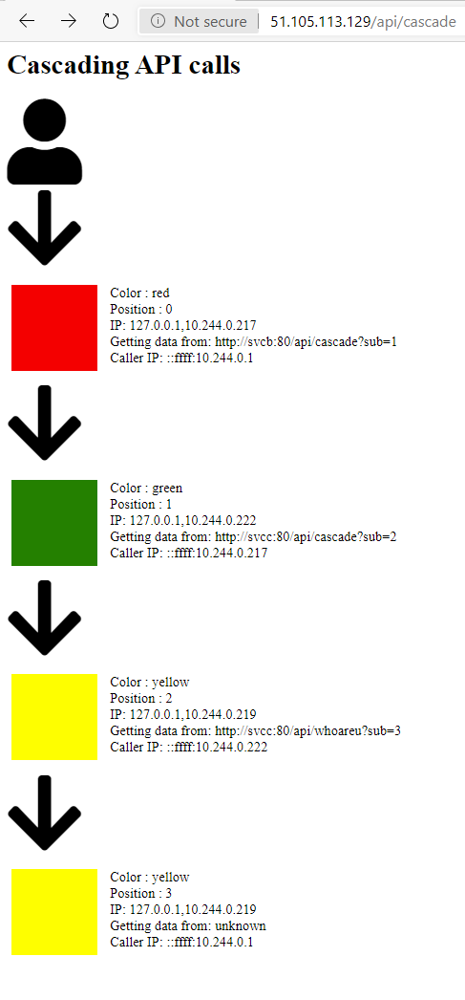

# DebugContainer
This container is supposed to help with debugging in multi-container environments or to just show off subsequent calls.

## Endpoints

When you start the container it will offer you 3 endpoints:

- /
   
   This will simply show a single page with a background color as configured.

- /ping

    This will return "Pong" and is supposed to be used for debugging.

- /api/whoareu

    This will return info about the client. Add ?sub=1 to the url and you get more fancy response.

- /api/cascade

    This will call another service and return the response of the other service to you. The other service has to be configured via environment variables.

## Configuration via environment variables


- SERVICEENDPOINTHOST

    DNS name or IP of a service to be called.
    
    Example: If the targeted service is running on myserver:8080/myapi the value requried here is *myserver*. 
    If running locally use *docker network inspect* to figure out your containers IPs. When using Kubernetes of course ideally you work with a service name here.
    
- SERVICEENDPOINTPORT
    
    Port of the service to be called via /api/cascade

    Example: If the targeted service is running on myserver:8080/myapi the value requried here is *8080*. 

- SERVICEENDPOINTPATH
    
    The path of the service to be called via /api/cascade
    
    Example: If the targeted service is running on myserver:8080/myapi the value requried here is */myapi*. 
    
    Yes. We need the leading "/"

- COLOR

    Defines the background color of the startpage (/). Also gives you a fancy UI when you call /api/cascade. 

## Run it on Kubernetes

You can run the yamls/3svc.yaml to get an easy setup in Kubernetes with 3 services where A is calling B and B is calling C.
Just run 
```
kubectl apply -f https://raw.githubusercontent.com/DanielMeixner/DebugContainer/master/yamls/3svc.yaml
```

Then run
```
kubectl get pods,svc
```

As soon as you get an IP for svca you can call it. Just call <IP-OF-SVCA>/api/cascade and you will see something like this.




## Run locally

Run it like this locally on your dev PC or just run it on Azure as described [here](https://docs.microsoft.com/en-us/azure/app-service/containers/tutorial-multi-container-app) :
```
docker run -it -p 8082:80  -e SERVICEENDPOINTHOST=172.17.0.1 -e SERVICEENDPOINTPATH=/api/whoareu -e COLOR=red -e SERVICEENDPOINTPORT=8083  danielmeixner/dbgcon:2
docker run -it -p 8083:80  -e SERVICEENDPOINTHOST=172.17.0.1 -e SERVICEENDPOINTPATH=/api/ping -e COLOR=blue -e SERVICEENDPOINTPORT=8083 danielmeixner/dbgcon:2
```

This will start two containers where the first one points to the second one. If you call the first container in a browser it will show a link to the api of the second.
*
